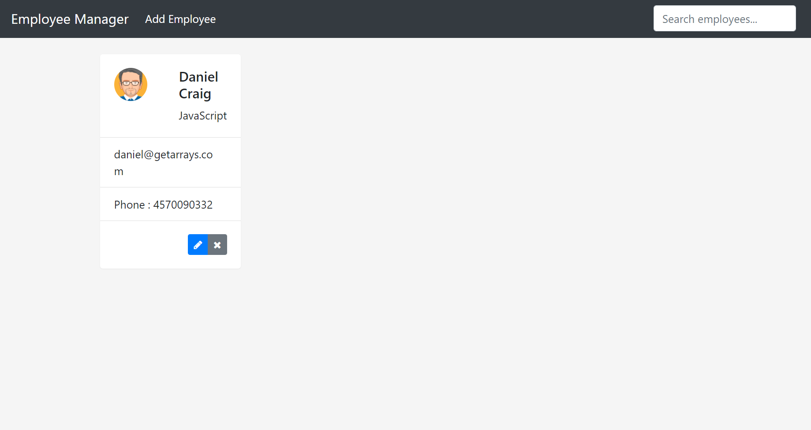

## Employee manage app 

This project was generated with Angular CLI version 15.2.4. And Springboot 2.5 

##Description

this project is a fullsatck web application developped in the backend with java in framwork Springboot, and the frontend is developed with Typescript in angular framwork.

the application is an example of CRUD application.
this is the home page of the.

Run ng serve for a dev server. Navigate to http://localhost:4200/. The app will automatically reload if you change any of the source files.

#Code scaffolding
Run ng generate component component-name to generate a new component. You can also use ng generate directive|pipe|service|class|guard|interface|enum|module.

#Build
Run ng build to build the project. The build artifacts will be stored in the dist/ directory. Use the --prod flag for a production build.

#Running unit tests
Run ng test to execute the unit tests via Karma.

#Running end-to-end tests
Run ng e2e to execute the end-to-end tests via Protractor.

#Further help
To get more help on the Angular CLI use ng help or go check out the Angular CLI README.
